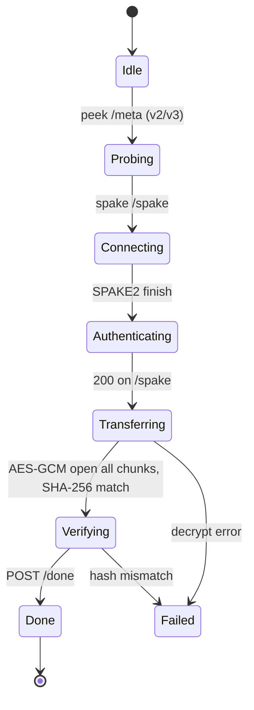

# Architecture

> This document describes how NexusCompress is put together. It's meant
> for contributors who want to navigate the codebase, debug a behaviour,
> or extend the system. If you're just looking to USE the app, see
> [README.md](./README.md) instead.

## High level

```
                  ┌──────────────────────────────────────────┐
                  │            Next.js (React) UI            │
                  │  src/frontend/                            │
                  │    - Neo Terminal layout                  │
                  │    - i18n (es / en / it)                  │
                  │    - tauri-plugin-dialog / drag-drop      │
                  └────────────┬─────────────────────────────┘
                               │ invoke()
                               ▼
                  ┌──────────────────────────────────────────┐
                  │           Rust core (Tauri 2)             │
                  │  src-tauri/                               │
                  │    - commands.rs          (27 invoke)    │
                  │    - p2p_tunnel.rs        (transport)    │
                  │    - p2p_auth.rs          (HMAC + SPAKE2)│
                  │    - p2p_config.rs        (token fmt)   │
                  │    - upnp_hole.rs         (NAT punch)    │
                  │    - archive_inspect.rs   (.tar/.nxs6)  │
                  │    - main.rs              (event loop)   │
                  └────────────┬─────────────────────────────┘
                               │
                               ▼
                  ┌──────────────────────────────────────────┐
                  │        NexusCompress engine (Rust)       │
                  │  src/                                     │
                  │    - lz77_hash_chain (LZ matching)       │
                  │    - rANS_entropy (entropy coding)        │
                  │    - dict_codec (block-level dictionary)  │
                  │    - solid_archive (TOC + extract)        │
                  │    - chunked_io                          │
                  └──────────────────────────────────────────┘
```

The same engine is callable from the CLI (`nexus c file output.nxs6`,
`nexus d output.nxs6 file.decoded`) and via the Tauri command surface.
The CLI exists primarily for benchmarking and unit tests; the GUI is
the supported user-facing surface.

## Engine layer (`src/`)

### `lz77_hash_chain`
Classic LZ77 with a chained hash table for match finding. Window is 64 KB
per block. Lazy matching evaluates positions i and i+1 to skip short
matches at the cost of one extra read.

### `rANS_entropy`
A 5-stream interleaved rANS coder. Each byte has a 4-bit high nibble +
4-bit low nibble split into two independent streams (4 streams), plus a
1-bit "match/literal" flag stream = 5 streams total. The interleaving
keeps the decoder cache-friendly.

Speed at decoding matters more than compression ratio because we expect
the decompressor to be used more often than the compressor (e.g. P2P
"sender compresses once, receiver decompresses once" but plugin use
might compress hundreds of times for the same data when the user
recompresses for benchmarking).

### `dict_codec`
A per-block dictionary hint. The compressor analyses the most frequent
substrings in each block and prepends them as a dictionary; the
decompressor reads the dictionary before the rANS streams.

This is the contribution over a stock rANS+LZ77 hybrid: the dictionary
is computed at compress time and shipped with the file. .nxs6 archives
have the dictionary at the head of each block.

### `solid_archive`
A TOC-at-front container format. The compressor writes the table of
contents before any payload, so a `.nxs6` archive can be listed without
decompressing the body. This is the same trick used by `.tar` (and the
reason WinRAR shows archive contents without unpacking).

Selective extraction is O(1) for the TOC + a single LZMA pass over the
slice of the file you care about. Solid compression applies inside each
block; between blocks, you can decompress independently.

### `chunked_io`
Streaming read/write with replayable cursor semantics. The P2P pipeline
reads / writes in fixed-size chunks (4 KiB payload + 16-byte AEAD tag)
which lets us pipeline encryption ↔ disk I/O ↔ network without holding
the full file in memory.

## GUI layer (`frontend/`)

### Neo Terminal UX

Three principles:

1. **One screen, one action.** The landing page shows three large cards
   (Comprimir, Descomprimir, Compartir). Each screen inside has a single
   primary CTA. No multi-step wizards.
2. **Human concepts over engineering jargon.** Compression modes are
   labelled "FAST", "BALANCED", "ULTRA" — not `v4` / `v5` / `v6`. The
   user shouldn't need to read the changelog to pick a mode.
3. **8-pixel spacing grid.** Layout uses Tailwind's `mb-8`, `p-12`, etc.
   consistently. No `mb-[13px]` magic numbers.

### i18n

A small custom i18n module (`src/lib/i18n.ts`) stores all locale strings
in one file per language. Three locales: `es` (Spanish — primary,
Rome-based developer), `en` (English — international), `it` (Italian —
covers the local community).

The locale is auto-detected from `navigator.language` on first launch
and persists in `localStorage`.

### Drag-drop vs dialog plugin

The native file picker in `tauri-plugin-dialog` is flaky on macOS
Sequoia when combined with `titleBarStyle: "Overlay"` frameless windows
— the picker opens but selection doesn't register (filed upstream as
tauri-apps/tauri#4316). Workaround in all input panels:

1. **Drag-and-drop** the file onto the panel (works via Tauri's internal
   `tauri://drag-drop` event — no OS picker involved)
2. **Paste / type** the absolute path (`Cmd+Opt+C` in Finder copies
   pathname)
3. **Native picker** as a tertiary fallback (works on Linux, Windows,
   older macOS)

## Transport layer (`src-tauri/src/p2p_tunnel.rs`)

### Threat model

We assume an attacker can:

- Read any ciphertext that traverses a relay
- Send packets to either endpoint
- Add, drop, or replay packets

We do NOT trust:

- The 4-word passphrase alone (32 bits = brute-forceable offline)
- The relay (Cloudflare's network)
- DNS / IP routing

### Key derivation

```
passphrase (4 words, ~32 bits entropy)
       │
       ▼
   Argon2id  (stretches to 256 bits effective entropy)
       │
       ▼
   KEK  ──────────────►  pre-auth HMAC key  (signs every request
       │                                        before SPAKE2)
       ├──────────────► SPAKE2 (Ed25519 group)  
       │                                               
       │                  ┌──────── SPAKE2 finish ───────►  shared secret
       │                                                   │
       ▼                                                   ▼
   request MAC                                         HKDF
                                                          │
                                                          ▼
                                                     session keys
                                                          │
                                                          ├──────────►  AES key
                                                          └──────────►  HMAC key
```

### Token formats

- **v1** — `nx:1:<base64url(json)>` — vintage Cloudflare Tunnel era.
  Filename was packed inside the base64 payload. Sanitised at trust
  boundary via `safe_basename()` (Sprint 5.6.26).
- **v2** — `nx:2:direct:<service-hash>:<code>` — modern Direct mode
  (LAN mDNS). `service-hash` is a SHA-256 prefix derived from the
  code so the receiver can mDNS-browse for it without knowing the IP.
- **v3** — `nx:3:relay:<ip>:<port>:<hash>:<code>` — cross-NAT UPnP
  with public IP. The IP is the sender's public IP (auto-hides in UI
  5s after generation for shoulder-surfing protection).

The leading `nx:N:` prefix lets the receiver dispatch to the right
parser. Older tokens still parse.

### Transport modes

| Mode | What it is | When it works | When it doesn't |
|------|-----------|---------------|----------------|
| **Direct LAN** (v2) | Sender advertises via mDNS on a SHA-256-derived service name. Receiver browses mDNS, connects, SPAKE2, transfer. | Same LAN, multicast not blocked | Across NATs, public WiFi with AP isolation |
| **Direct cross-NAT** (v3) | Sender does UPnP hole-punching, gets a public IP. Token carries the IP. Receiver tries the public IP first (2s timeout), falls back to mDNS. | Sender has UPnP-enabled router, ~70% of residential ISPs | Symmetric NAT, captive portals, corporate firewalls blocking UPnP |
| **Cloudflare Quick Tunnel** | Sender creates an ephemeral Cloudflare tunnel with a random `*.trycloudflare.com` hostname. Token carries the URL. | Anywhere with outbound HTTPS. Anonymous, no signup. | Cloudflare rate-limits after 3-5 connections, sometimes blocks IP ranges entirely |
| **Cloudflare Named Tunnel** | Pre-configured hostname (`p2p.your-domain.com`), stable token in OS keyring. | Anywhere with outbound HTTPS, no rate limit. | Needs a Cloudflare account + custom domain |

**Default in Sprint 5.6.5+:** Direct mode. Cloudflare is only used as
last resort.

### Authenticated requests

Every privileged endpoint (`/spake`, `/file`, `/done`) requires a
`X-Nexus-Auth` header: `X-Nexus-Auth: <unix_ts>|<base64-hmac>`.

The HMAC signs `<ts>|<method>|<path>` with the pre-auth key derived
from the passphrase via Argon2id + HKDF. Rate-limiting happens BEFORE
the HMAC check so an attacker can't burn CPU on HMAC validation.

Errors are uniform 401 — never distinguish between "bad signature",
"expired timestamp", or "rate limited" (anti-fingerprinting).

### Authenticated file transfer

`/file` is requested with TWO HMACs:

1. **Pre-auth HMAC** (`X-Nexus-Auth`) — proves the request came from
   someone who knows the passphrase. Verified by middleware. Requires
   Direct mode (in Cloudflare relay mode, only `/meta` and `/done`
   need it; the SPAKE2-derived MAC handles the rest).
2. **Session HMAC** (`X-P2P-Auth`) — proves the request came from
   the established session. Computed with the HKDF-derived session
   MAC key. Required by the `/file` handler in both modes.

The 4-byte length prefix on each chunk + the 16-byte AEAD tag together
give end-to-end integrity. Any tampering causes the receiver to
terminate the transfer mid-stream with a "corrupted chunk" error.

## State machine



State is stored per-sender in `Arc<Mutex<Option<StartedSend>>>` at
`src-tauri/src/main.rs`. The 10-minute hard-timeout watcher in
`p2p_tunnel.rs` reaps abandoned senders (Sprint 5.6.15).

## Cross-platform notes

### macOS

- `/usr/bin/tar` (BSD tar) for the folder → .tar wrapper (Sprint 5.6.5)
- `/usr/bin/xattr -d com.apple.quarantine` to strip Gatekeeper's download
  attribution on received files (Sprint 5.6.14, hardened 5.6.23)
- `mdns-sd` works with Bonjour natively
- `keyring` uses the macOS Keychain
- Bundled as a universal binary (Apple Silicon + Intel) with codesign +
  notarisation in CI
- `cloudflared-darwin-{arm64,amd64}.tgz` auto-downloaded on first
  send in Cloudflare mode

### Linux

- `tar` (in `$PATH`) for folder wrapping — works on glibc and musl
- mDNS via Avahi (`mdns-sd` uses NSS / Avahi transparently)
- `keyring` uses Secret Service (D-Bus; GNOME Keyring, KWallet)
- UPnP via `igd` (pure Rust, talks IGD over UPnP SSDP multicast)
- Packaged as `.deb` (Debian / Ubuntu), `.rpm` (Fedora / RHEL), and
  `.AppImage` (universal)
- `cloudflared-linux-{amd64,arm64}` auto-downloaded

### Windows

- `tar` is in `%SystemRoot%\System32\tar.exe` since Windows 10 1803
  (April 2018 Update) — we just spawn `tar` and let PATH resolve it
- mDNS via the built-in Windows mDNS Responder Service (always on
  since Windows 10)
- `keyring` uses the Windows Credential Manager
- UPnP via Windows' built-in IGD client (NETWORK DISCOVERY + IGD
  Service)
- Packaged as MSI installer (per-user, no admin needed) plus a
  portable ZIP
- `cloudflared-windows-amd64.exe` auto-downloaded
- **ARM64 Windows** is not officially supported yet — `cloudflared`
  does have an ARM64 build, but we don't ship a config for it

## Test surface

```
src/                              # engine unit tests
src-tauri/src/p2p_tunnel.rs       # 119 crypto + protocol tests
src-tauri/src/p2p_auth.rs         # 8 HMAC + rate-limit tests
src-tauri/src/archive_inspect.rs  # 16 listing + extract tests
src-tauri/bin/p2p_smoke.rs        # 8 module-private tests
src-tauri/bin/e2e_v3.rs           # integration tests
```

Total: **149 unit/integration tests**, all running in <1 second on a
modern machine. `e2e_v3` requires a live network (sender ↔ real / real
↔ real) and skips in `cargo test` runs.

## Performance notes

- LAN field test (Sprint 5.5.2, two macOS on the same WiFi):
  49 MB/s, 127 MiB / 2.6 s
- Named Tunnel field test (Sprint 5.5.1, 4G mobile hotspot):
  11 MB/s
- Compression vs `zstd -19` is competitive on JSON / source code
  corpus but loses on already-compressed inputs (PNG, MP4). Use
  `zstd` instead for those.

## Open questions / future work

- Selective extraction of `.nxs6` archives requires 1 full LZMA pass
  (solid compression). For fully random-access we'd need a different
  container format (e.g. zip-like entry-per-block) — feels like a
  different mode ("Browse Mode" vs "Solid Mode") rather than a
  compatibility break.
- The dictionary codec has a configuration knob for the per-block
  dictionary size but the UI doesn't expose it. We default to 4 KiB
  which is sweet-spot for typical text corpora.
- Cloudflare Named Tunnel hostnames are stored in `nexus_config.json`
  in plaintext. Worth encrypting them with the OS keyring for the
  parity with the token.
